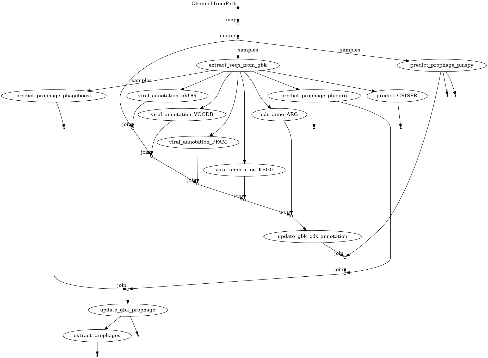

# TPD: A Computational Pipeline for Therapeutic Phage Discovery from Prophages

[](https://zenodo.org/badge/latestdoi/326435779)

# Install

```sh
conda env create -f environment.yml
```

# Usage

```sh
nextflow run tpd.nf -profile hpc_slurm --mode "all" --datadir data -resume
```

If you want to add previous predicted prophages, put `${sampleID}_old.gbk` in `data` folder.

# Flowchart

## `gbk_annotation.nf`



# TODO


